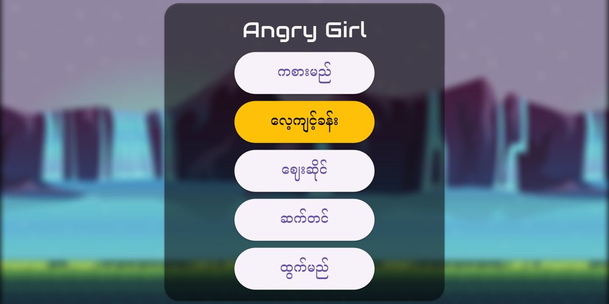
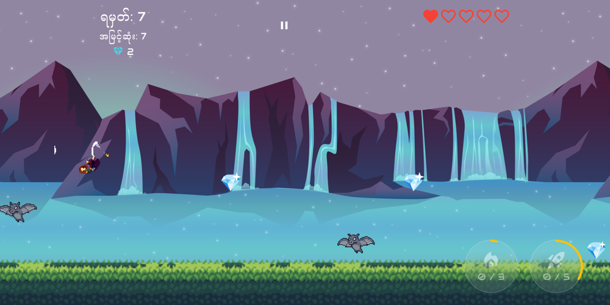
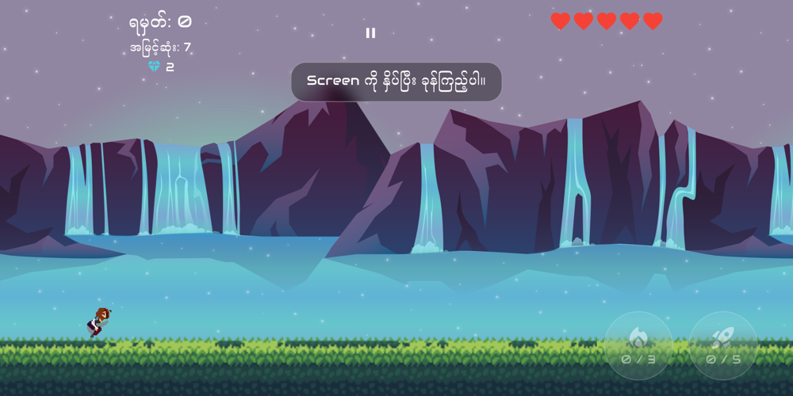
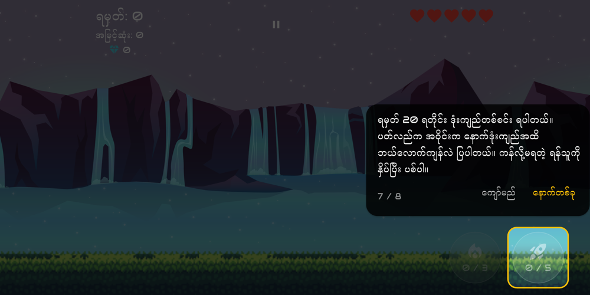
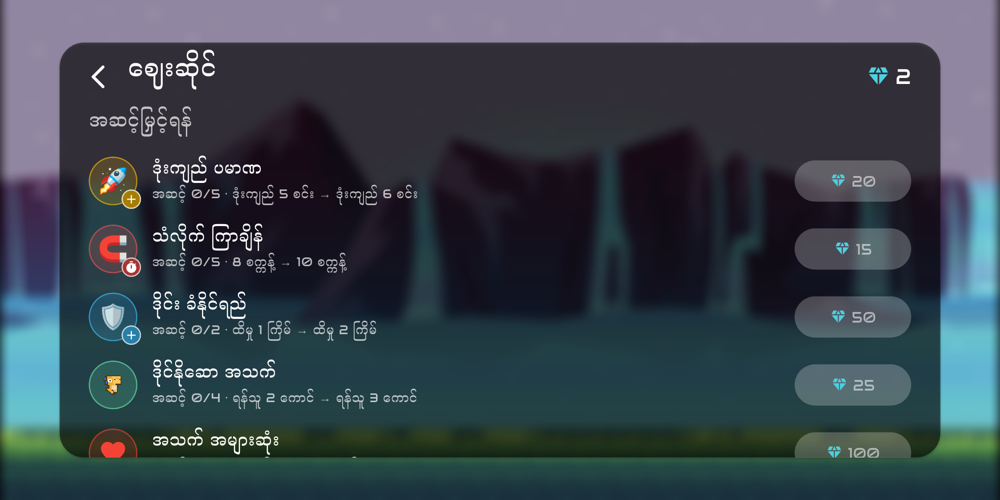
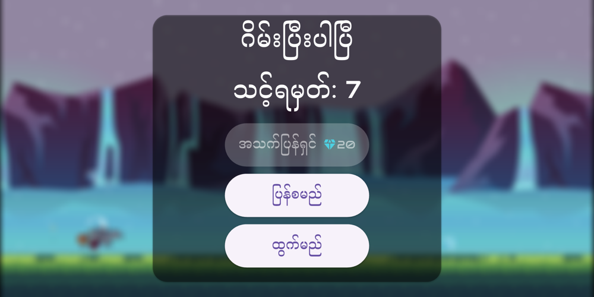

# Angry Girl

A 2D endless runner game for Android and iOS, built with Flutter and the Flame game engine.
The game is in Myanmar and English.

> **Angry Girl** သည် ဆက်တိုက်ပြေးရသော 2D ဂိမ်း ဖြစ်ပါတယ်။ ရန်သူတွေကို ခုန်ကျော်၊ ကန်၊ ဒုံးကျည်နဲ့ ပစ်ပြီး
> စိန်တွေ စုကာ ဆိုင်မှာ upgrade တွေ ဝယ်နိုင်ပါတယ်။ မြန်မာ နဲ့ English နှစ်ဘာသာ ရပါတယ်။

<p align="center">
  
  
</p>

## Download

**[⬇️ Download the Android APK](https://drive.google.com/file/d/11A7lRq0dB8kvwpPZZ3PBcD_UyZifrOfx/view?usp=drive_link)**

1. Open the link on your Android phone and download the APK file.
2. Open the downloaded file. If Android asks, allow installing apps from this source
   (Settings → *Install unknown apps*).
3. Tap **Install**, then open **Angry Girl**.

> Android ဖုန်းမှာ အပေါ်က link ကိုဖွင့်ပြီး APK ကို download လုပ်ပါ။ File ကိုဖွင့်ပြီး
> "Install unknown apps" ကို ခွင့်ပြုပေးကာ **Install** ကို နှိပ်ပါ။

## Gameplay

Tap the screen to jump over enemies, and tap again in the air to double jump.
Run into the enemies that can be kicked to knock them down for points, and avoid or shoot the rest.
You start with 5 lives: an enemy takes a heart and a fireball takes half a heart.

| Every    | You get                                              |
| -------- | ---------------------------------------------------- |
| 20 pts   | A rocket, fired with the rocket button               |
| 50 pts   | A helper dino, which knocks out enemies in front     |
| 100 pts  | A power-up: a shield or a magnet                     |
| 200 pts  | A burst, which drops bombs on the 2 nearest enemies  |
| 400 pts  | A helper bat, which carries you through the air      |

The game gets harder as you score: enemies that breathe fireballs and throw rockets come at
100, 200 and 300 points, and more kinds of enemies join after 500 points.

### Features

- **Power-ups**: a shield blocks hits, a magnet pulls in diamonds, and a helper bat carries
  you safely over the enemies for a few seconds.
- **Shop**: spend diamonds on upgrades (rocket capacity, magnet and bat time, shield strength,
  max lives, …), one-game items, skins, backgrounds, music and colours.
- **Revive**: pay diamonds to keep playing after losing all your lives.
- **First-time guide and tutorial**: new players get a guide to the game screen, and a
  tutorial teaches jumping, kicking, collecting and firing step by step.
- **Two languages**: Myanmar and English, with names of the enemies that you can change.

## Screenshots

| Tutorial | Screen guide |
| :---: | :---: |
|  |  |
| **Shop** | **Game over** |
|  |  |

## Built with

| Technology | Used for |
| --- | --- |
| [Flutter](https://flutter.dev) 3.41 / Dart 3.11 | App, menus and game overlays |
| [Flame](https://pub.dev/packages/flame) 1.38 | Game loop, sprites, animations, collisions, parallax background |
| [flame_audio](https://pub.dev/packages/flame_audio) | Background music and sound effects |
| [Hive](https://pub.dev/packages/hive) | Saving the player data and settings on the device |
| [Provider](https://pub.dev/packages/provider) | Updating the HUD and menus when the player data changes |
| [package_info_plus](https://pub.dev/packages/package_info_plus) | App version in the about screen |
| [url_launcher](https://pub.dev/packages/url_launcher) | Opening the email app from the about screen |

### Project structure

```
lib/
├── main.dart          App entry, Hive setup and overlay registration
├── game/              Flame components: the game, Ninja, enemies, items, helpers
├── models/            Player data, settings, shop items and texts (Hive models)
└── widgets/           Flutter overlays: menus, HUD, shop, guide
assets/
├── images/            Sprites and backgrounds (see the credits below)
└── audio/             Music and sound effects
```

## Getting started

Requirements: Flutter 3.41 or newer. Android builds use Android Gradle plugin 8.9.1 and NDK 28.2.

```sh
flutter pub get
flutter run            # run on a connected device or emulator
flutter test           # run the tests
flutter build apk      # build an Android APK
```

## Credits

The images, sprites and sounds are not owned by this repository's owner.
Their authors and licences are listed in [assets/images/readme.md](assets/images/readme.md)
and [assets/audio/readme.md](assets/audio/readme.md).

## Developer

Aung Naing Phyo · [aung.anp.2006@gmail.com](mailto:aung.anp.2006@gmail.com)
